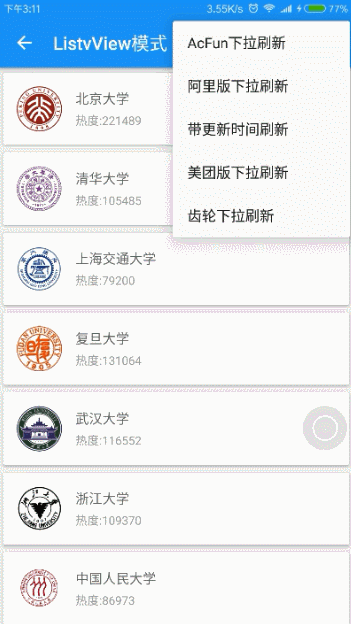
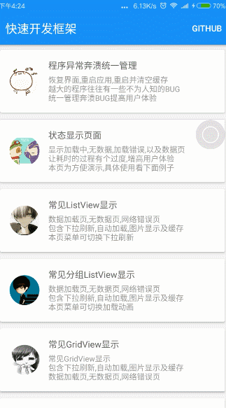
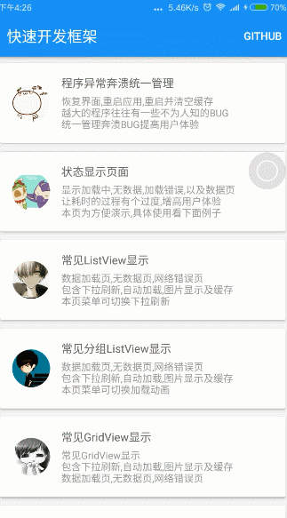
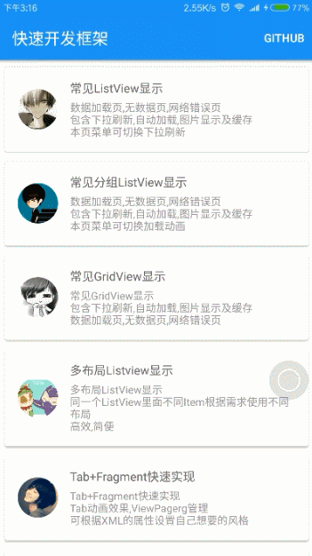

# RapidDevelop-Android Rapid development framework
 - The framework is continually being updated
 - This framework is from the usual project used in the framework of more integrated from
 - Interested in this project can be like to study a friend welcome star
 - Also welcome your valuable comments
 - If you are interested in MVP mode of development of network crawler and cache strategy can look at my latest writing Freebook
 - E-mail: mychinalance@gmail.com
 - [Download APK](http://fir.im/LCRapidDevelop)

###[中文](README.md)
--------
##Function Description
 - retrofit rxjava okhttp rxcache ------------------------------ Network requests and network caching
 - Demo using MVP mode development ------------------------------------ data logical multiplexing, easy maintenance upgrade
 - Pull-down and pull-up loading and auto-loading --------------------------- Implementation of fast and easy monitoring
 - RecyclerView Adapter ------------------------------------------ No longer required Write ViewHolder
 - RecyclerView item loading animation -------------------------------- A variety of animation effects a line of code to solve
 - page status unified management load no data no network ------------- all pages can be added
 - Picture display and cache GIF picture display
 - Tab + Fragment fast implementation
 - Video playback (imitation QQ space, seconds, etc. List playback)

--------

##Renderings show
      

--------------

##Instructions for use

Import lcrapiddeveloplibrary into the project

In the dependencies of build.gradle add:

    dependencies {
    compile fileTree(include: ['*.jar'], dir: 'libs')
    ....
    compile project(':lcrapiddeveloplibrary')
    }

##Easy to implement state page drop-down refresh automatically load item animation
First layout.xml inside the preparation of the list of pages are basically the routine
```
<!--ProgressActivity Used for control of status pages such as loading network exceptions No data is available for any page-->
<com.xiaochao.lcrapiddeveloplibrary.viewtype.ProgressActivity
    xmlns:progressActivity="http://schemas.android.com/apk/res-auto"
    android:id="@+id/progress"
    android:layout_width="match_parent"
    android:layout_height="match_parent">
    <LinearLayout
        android:layout_width="match_parent"
        android:layout_height="match_parent"
        android:orientation="vertical"
        >
        <!--SpringView drop-down refresh-->
        <com.xiaochao.lcrapiddeveloplibrary.widget.SpringView
            android:id="@+id/springview"
            android:layout_width="match_parent"
            android:layout_height="match_parent"
            android:background="#FFFFFF"
            >
            <android.support.v7.widget.RecyclerView
                android:id="@+id/rv_list"
                android:layout_width="match_parent"
                android:layout_height="match_parent"
                android:background="#eeeeee"/>
        </com.xiaochao.lcrapiddeveloplibrary.widget.SpringView>

    </LinearLayout>
</com.xiaochao.lcrapiddeveloplibrary.viewtype.ProgressActivity>
```
And then there is the Activity of the preparation of the use of this example to write MVP model interested in the latest I write[Freebook](https://github.com/80945540/FreeBook)
```
public class ListvViewActivity extends AppCompatActivity implements BaseQuickAdapter.RequestLoadMoreListener,SpringView.OnFreshListener,SchoolListView {

    RecyclerView mRecyclerView;
    ProgressActivity progress;
    private Toolbar toolbar;
    private BaseQuickAdapter mQuickAdapter;
    private int PageIndex=1;
    private SpringView springView;
    private SchoolListPresent present;

    @Override
    protected void onCreate(Bundle savedInstanceState) {
        super.onCreate(savedInstanceState);
        setContentView(R.layout.activity_listv_view);
        initView();
    }


    private void initView() {
        present = new SchoolListPresent(this);
        mRecyclerView = (RecyclerView) findViewById(R.id.rv_list);
        springView = (SpringView) findViewById(R.id.springview);
        //Set the drop-down listener
        springView.setListener(this);
        //Sets the drop-down refresh style
        springView.setHeader(new RotationHeader(this));
        progress = (ProgressActivity) findViewById(R.id.progress);
        mRecyclerView.setLayoutManager(new LinearLayoutManager(this));
        //If the Item height is fixed, increasing this property will increase the efficiency
        mRecyclerView.setHasFixedSize(true);
        //sets adapter
        mQuickAdapter = new ListViewAdapter(R.layout.list_view_item_layout,null);
        //Sets the loading animation
        mQuickAdapter.openLoadAnimation(BaseQuickAdapter.SCALEIN);
        //Set whether to automatically load and load the number
        mQuickAdapter.openLoadMore(6,true);
        //Add the adapter to the RecyclerView
        mRecyclerView.setAdapter(mQuickAdapter);
        //Sets the auto-load listener
        mQuickAdapter.setOnLoadMoreListener(this);
        //Requests network data
        present.LoadData(PageIndex,12,false);
    }
   // Load automatically
    @Override
    public void onLoadMoreRequested() {
        PageIndex++;
        present.LoadData(PageIndex,12,true);
    }
    //Pull down to refresh
    @Override
    public void onRefresh() {
        PageIndex=1;
        present.LoadData(PageIndex,12,false);
    }
  
    /*
    * MVP mode of the relevant state
    *
    * */
    @Override
    public void showProgress() {
        progress.showLoading();
    }

    @Override
    public void hideProgress() {
        progress.showContent();
    }

    @Override
    public void newDatas(List<UniversityListDto> newsList) {
        // Enter the initial data for the display or pull down to refresh the displayed data
        mQuickAdapter.setNewData(newsList); // Add data
        mQuickAdapter.openLoadMore(10,true);/ / set whether it can load and load the number of pull-down
        springView.onFinishFreshAndLoad();// Refresh done
    }

    @Override
    public void addDatas(List<UniversityListDto> addList) {
        // Add automatically loaded data
        mQuickAdapter.notifyDataChangedAfterLoadMore(addList, true);
    }

    @Override
    public void showLoadFailMsg() {
        // Set the load error page display
        progress.showError(getResources().getDrawable(R.mipmap.monkey_cry), Constant.ERROR_TITLE, Constant.ERROR_CONTEXT, Constant.ERROR_BUTTON, new View.OnClickListener() {
            @Override
            public void onClick(View v) {
                PageIndex=1;
                present.LoadData(PageIndex,12,false);
            }
        });
    }

    @Override
    public void showLoadCompleteAllData() {
        // Displayed after all data is loaded
        mQuickAdapter.notifyDataChangedAfterLoadMore(false);
        View view = getLayoutInflater().inflate(R.layout.not_loading, (ViewGroup) mRecyclerView.getParent(), false);
        mQuickAdapter.addFooterView(view);
    }

    @Override
    public void showNoData() {
        //Set the no data display page
        progress.showEmpty(getResources().getDrawable(R.mipmap.monkey_cry),Constant.EMPTY_TITLE,Constant.EMPTY_CONTEXT);
    }
}
```

# # Easy to play video list
The list of parts and the above is not the same, I am here to describe the main part of the video player is not know how to clone to the local warehouse side of the run

item_layout.xml 
```
<LinearLayout
        android:layout_width="match_parent"
        android:layout_height="wrap_content"
        android:padding="5dp"
        android:orientation="vertical">
        <com.xiaochao.lcrapiddeveloplibrary.Video.JCVideoPlayerStandard
            android:id="@+id/video_list_item_playr"
            android:layout_width="match_parent"
            android:layout_height="wrap_content"/>
        <LinearLayout
            android:layout_width="match_parent"
            android:layout_height="match_parent"
            android:orientation="horizontal"
            android:padding="5dp"
            android:gravity="center_vertical">
            <ImageView
                android:id="@+id/video_list_item_image"
                android:layout_width="100dp"
                android:layout_height="70dp"
                android:src="@mipmap/def_head"/>
            <LinearLayout
                android:layout_width="0dp"
                android:layout_weight="1"
                android:layout_height="wrap_content"
                android:layout_marginLeft="15dp"
                android:layout_marginTop="5dp"
                android:layout_marginBottom="5dp"
                android:layout_marginRight="10dp"
                android:orientation="vertical">
                <TextView
                    android:id="@+id/video_list_item_text_title"
                    android:layout_width="wrap_content"
                    android:layout_height="wrap_content"
                    android:textColor="#66666"
                    android:textSize="15dp"/>
                <TextView
                    android:id="@+id/video_list_item_text_context"
                    android:layout_width="wrap_content"
                    android:layout_marginTop="5dp"
                    android:textColor="#999999"
                    android:textSize="13dp"
                    android:lines="3"
                    android:ellipsize="end"
                    android:layout_height="wrap_content"/>
            </LinearLayout>
        </LinearLayout>

    </LinearLayout>
```
Then there is the adapter inside the video control assignment
```
public class VideoLisViewAdapter extends BaseQuickAdapter<VideoListDto> {

    public VideoLisViewAdapter(int layoutResId, List<VideoListDto> data) {
        super(layoutResId, data);
    }

    public VideoLisViewAdapter(List<VideoListDto> data) {
        super(data);
    }

    public VideoLisViewAdapter(View contentView, List<VideoListDto> data) {
        super(contentView, data);
    }

    @Override
    protected void convert(BaseViewHolder helper, VideoListDto item) {
        helper.setText(R.id.video_list_item_text_title,item.getTitle()).setText(R.id.video_list_item_text_context,item.getIntroduction());
        Glide.with(mContext)
                .load(item.getPictureUrl())
                .crossFade()
                .placeholder(R.mipmap.def_head)
                .into((ImageView) helper.getView(R.id.video_list_item_image));
        // Add to the video video playback address (using the original address. Mp4 like this to pay attention) and the title
        ((JCVideoPlayerStandard)helper.getView(R.id.video_list_item_playr)).setUp(item.getAppVideoUrl(),item.getTitle());
        Glide.with(mContext)
                .load(item.getPictureUrl())
                .crossFade()
                .placeholder(R.mipmap.main_mini_m)
                .into((((JCVideoPlayerStandard) helper.getView(R.id.video_list_item_playr)).thumbImageView));
    }
}
```
### Tab + Fragment fast implementation
Or the original recipe layout.xml
```
<?xml version="1.0" encoding="utf-8"?>
<LinearLayout xmlns:android="http://schemas.android.com/apk/res/android"
    xmlns:tools="http://schemas.android.com/tools"
    android:layout_width="match_parent"
    android:layout_height="match_parent"
    xmlns:app="http://schemas.android.com/apk/res-auto"
    android:orientation="vertical"
    tools:context="com.xiaochao.lcrapiddevelop.UI.Tab.TabActivity">
    <android.support.v7.widget.Toolbar
        android:id="@+id/toolbar"
        android:layout_width="match_parent"
        android:layout_height="?attr/actionBarSize"
        android:background="?attr/colorPrimary"
        app:popupTheme="@style/AppTheme.PopupOverlay" />
    <FrameLayout
        android:id="@+id/tab"
        android:layout_width="match_parent"
        android:layout_height="wrap_content"
        android:background="#fff"
        />
    <android.support.v4.view.ViewPager
        android:id="@+id/viewpager"
        android:layout_width="match_parent"
        android:layout_height="match_parent"
        />
</LinearLayout>
```
Then is the head of the xml prepared
```
<com.xiaochao.lcrapiddeveloplibrary.SmartTab.SmartTabLayout
    xmlns:android="http://schemas.android.com/apk/res/android"
    xmlns:app="http://schemas.android.com/apk/res-auto"
    android:id="@+id/viewpagertab"
    android:layout_width="match_parent"
    android:layout_height="40dp"
    android:background="#FFFFFF"

    app:stl_defaultTabTextColor="@color/custom_tab"
    app:stl_distributeEvenly="true"
    app:stl_defaultTabTextHorizontalPadding="5dp"
    app:stl_indicatorColor="@color/title_bag"
    app:stl_indicatorCornerRadius="0dp"
    app:stl_indicatorInterpolation="smart"
    app:stl_indicatorThickness="3dp"
    app:stl_defaultTabTextSize="13dp"
    app:stl_dividerColor="@color/bag_gray"
    app:stl_dividerThickness="1dp"
    app:stl_overlineColor="@color/bag_gray"
    app:stl_underlineColor="#00000000"
    app:stl_defaultTabBackground="@color/bag_gray_transparent"
    />
```
Can play according to their own style to play the following table can be set to the property

---------
| Attr | Description |
|: ------- |
| Stl_indicatorAlwaysInCenter | If set to true, active tags are always displayed in the center (such as the newsstands google app), the default error |
| Stl_indicatorWithoutPadding | If set to true, the painted metrics are not populated in the tab, the default error |
Stl_indicatorInFront | The underline of the indicator before the draw, the default error |
| Stl_indicatorInterpolation | Behavioral metrics: Linear or Smart |
| Stl_indicatorGravity | Position indicators for graphs: "bottom" or "front" or "center", default "bottom" |
| Stl_indicatorColor | The color of the flag |
| Stl_indicatorColors | Multiple color metrics that set the color of each tab |
| Stl_indicatorThickness |
| Stl_indicatorWidth | width of the indicators, the default "car" |
| Stl_indicatorCornerRadius | Metric of fillet radius |
| Stl_overlineColor | The color of the top line
| Stl_overlineThickness | thickness of the top line
Stl_underlineColor | The bottom line of the color
Stl_underlineThickness | The bottom line of the thickness
| Stl_dividerColor | Color separator between tabs |
| Stl_dividerColors | Multiple color tabs between the tabs that can set the color of each tab |
| Stl_dividerThickness | the thickness of the divider |
| Stl_defaultTabBackground | Background can be pulled for each tab. General settings StateListDrawable |
| Stl_defaultTabTextAllCaps | If set to true, all tab titles are uppercase, the default fact |
| Stl_defaultTabTextColor | The color of the text includes the default tab |
| Stl_defaultTabTextSize | The text includes the default tab size |
| Stl_defaultTabTextHorizontalPadding | Text Layout Fill Default tabs include |
| Stl_defaultTabTextMinWidth | The minimum width of the label |
| Stl_customTabTextLayoutId | Layout ID Defines the custom tab. If you do not specify a layout, use the default tab
| Stl_customTabTextViewId | Text View ID in a custom tab layout. If you do not define customTabTextLayoutId, do not work with
| Stl_distributeEvenly | If set to true, each tab gives the same weight, the default error |
| Stl_clickable | If set to false, disable the Select tab click, Default |
| Stl_titleOffset | If set to "auto_center", the center of the middle slide tab will continue. If you specify a dimension that will offset the left edge, the default is 24 dp |
| Stl_drawDecorationAfterTab | After painting decorations (indicators and lines) drawing tab, the default error |

--------
Well the next TabActivity
```
public class TabActivity extends AppCompatActivity {

    ViewGroup tab;
    ViewPager viewpager;
    @Override
    protected void onCreate(Bundle savedInstanceState) {
        super.onCreate(savedInstanceState);
        setContentView(R.layout.activity_tab);
        initView();
    }

    private void initView() {
        tab = (ViewGroup) findViewById(R.id.tab);
        viewpager = (ViewPager) findViewById(R.id.viewpager);
        tab.addView(LayoutInflater.from(this).inflate(R.layout.tab_top_layout, tab, false));
    
        SmartTabLayout viewPagerTab = (SmartTabLayout) findViewById(R.id.viewpagertab);
        
        FragmentPagerItems pages = new FragmentPagerItems(this);
        
        for (int i=0;i<4;i++) {
            pages.add(FragmentPagerItem.of("Tab"+i, TabFragment.class));
        }

        FragmentPagerItemAdapter adapter = new FragmentPagerItemAdapter(
                getSupportFragmentManager(), pages);

        viewpager.setAdapter(adapter);
        viewPagerTab.setViewPager(viewpager);
    }
}
```

--------
##Special thanks to
 - [JieCaoVideoPlayer](https://github.com/lipangit/JieCaoVideoPlayer)
 - [SpringView](https://github.com/liaoinstan/SpringView)
 - [SmartTabLayout](https://github.com/ogaclejapan/SmartTabLayout)
 - [BaseRecyclerViewAdapterHelper](https://github.com/CymChad/BaseRecyclerViewAdapterHelper)
